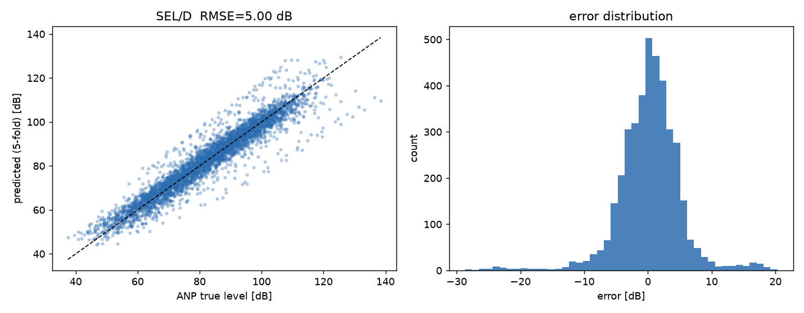
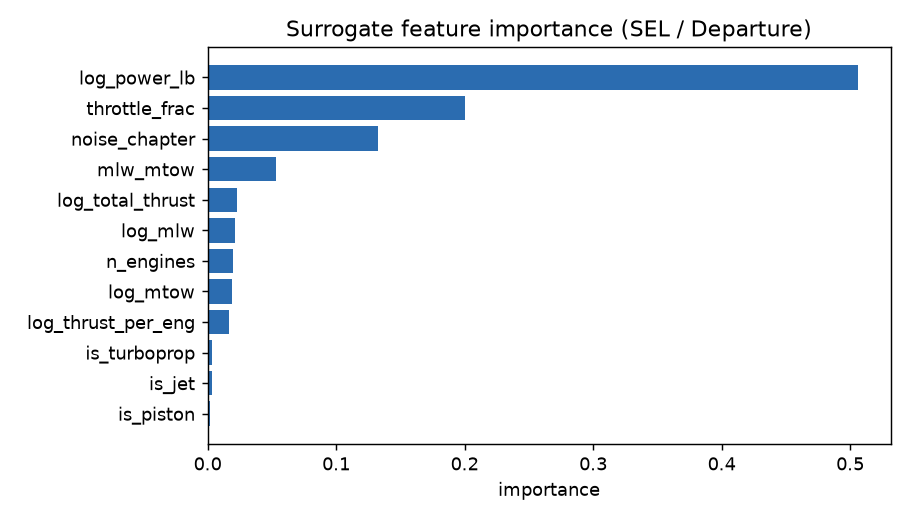
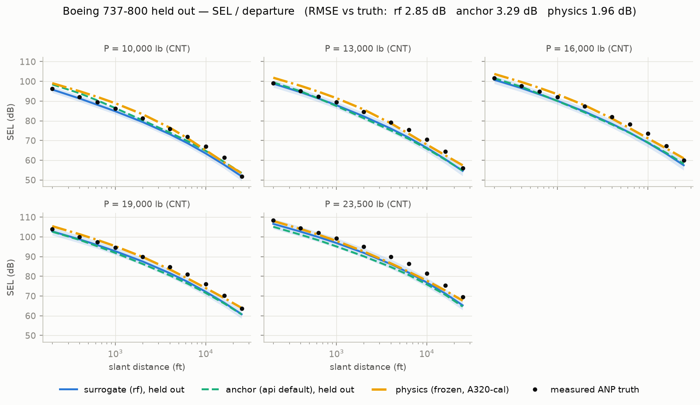
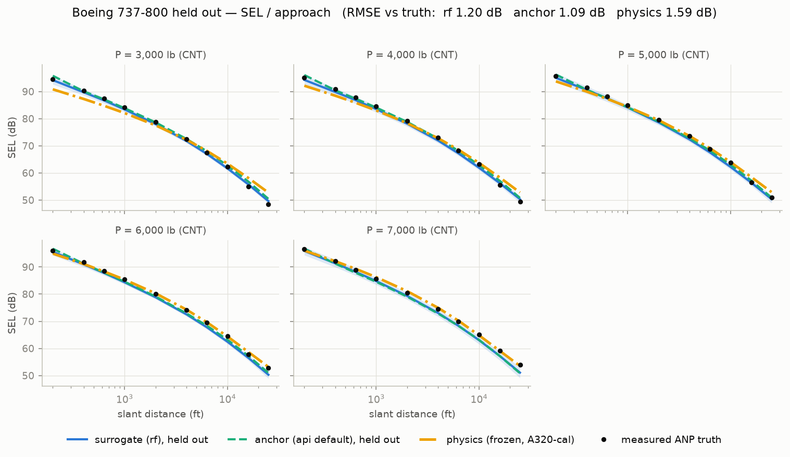
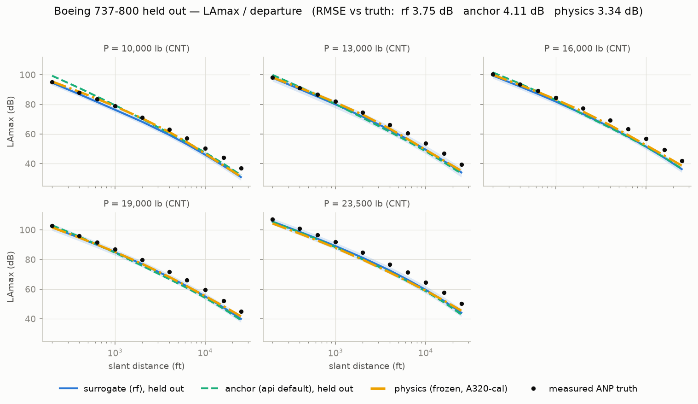
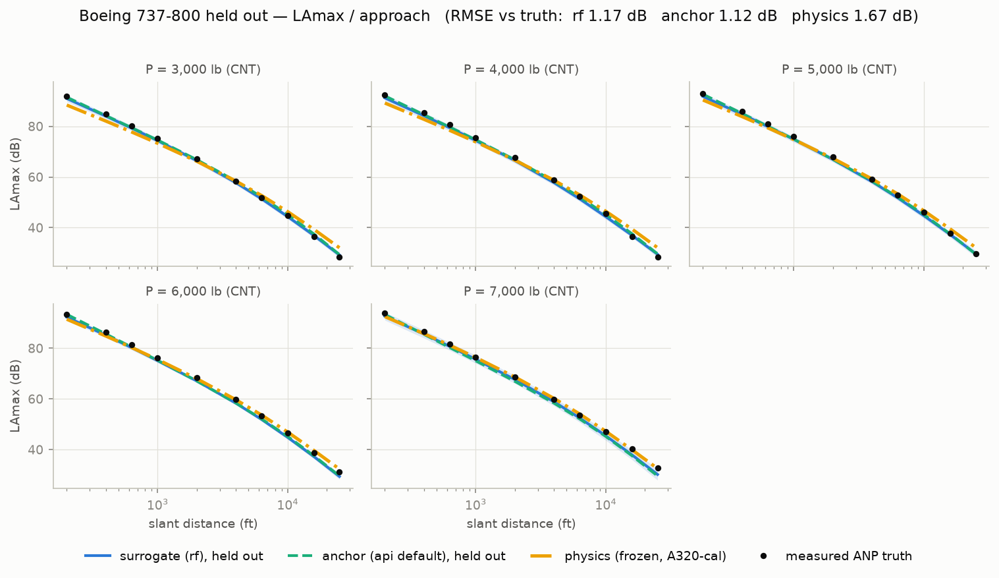
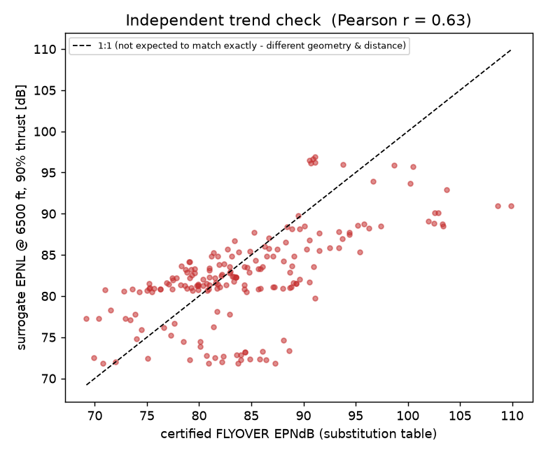
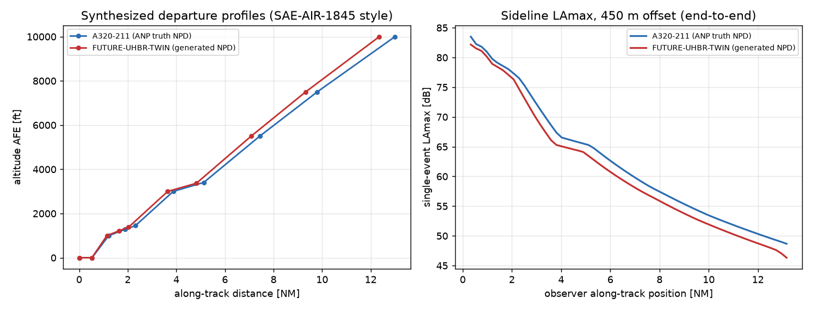

# PNMF — Historical Results Report

> **Historical, superseded evidence (2026-07-13).** Rankings, commands and
> accuracy figures below refer to the legacy 111-set corpus and retired
> experiments. They must not be cited as current production validation.
> Current learned-model evidence is in `MODEL_TRAINING_REPORT.md`. Current
> production scope is ET/RF plus the independent `PhysicsNPDModel`.

**Parametric Noise Modeling Framework** · TU Darmstadt / FSR Advanced Design
Project (Prof. Klingauf, supervised by L. Kempf)

*Report date: 2026-07-13. Every number in this report comes from the full
post-merge reproduction run of that date (see §6); figures are frozen copies
in `docs/figures/` of the corresponding `outputs/` artifacts.*

---

## 1. Executive summary

PNMF maps a **parametric aircraft definition** (thrust, weights, engine
count/type, noise chapter, optionally BPR/geometry) onto an
**NPD-equivalent noise table** in the exact layout of the EASA ANP
database, so that future aircraft concepts — for which no certification
data exists — can be assessed inside the established ANP/Doc-29 noise
pipeline. Two fully independent prediction routes are implemented and
cross-check each other:

- a **data-driven surrogate** (RandomForest family, `pnmf/models.py`)
  trained on the real ANP fleet, with per-cell uncertainty;
- a **from-scratch physics model** (`pnmf/physics.py`, pyNA-family
  component sources) whose five constants were calibrated **once** on the
  A320-211 and then frozen — every other prediction is genuinely
  out-of-sample.

Headline accuracy against real certification-derived data:

| Test | Result |
|---|---|
| Fleet-wide leave-one-aircraft-out (111 aircraft, 8 metric:mode pairs) | 4.2–5.4 dB pooled RMSE |
| Named hold-out case study (Boeing 737-800) | 1.1–1.5 dB (approach), 2.9–4.1 dB (departure) |
| Frozen physics route, 12-aircraft out-of-sample fleet check | 2.82 dB median RMSE |
| Physics vs surrogate on a future concept (independent routes) | 0.2 dB mean agreement |
| External trend check vs 19,565 certificated aircraft | r = 0.63 |

For context, the DLR/NASA/ONERA ANSWr inter-tool comparison treats 3–4 dB
as good agreement between *established* noise tools, and EASA's own
manually-curated aircraft substitutions carry a real 1.9/1.4 dB RMSE
mismatch (§2.3) — the practical accuracy floor for any proxy method.

---

## 2. Validation against real data

The ANP database's NPD tables are derived from certification measurement
campaigns — they are the "real data" ground truth throughout. Three
independent validation layers were used; none of them lets a model see the
aircraft it is being tested on.

### 2.1 Fleet-wide leave-one-aircraft-out (LOO)

For each of the 111 jet aircraft with NPD curves: retrain the surrogate on
the entire fleet *minus* that aircraft, predict its full NPD table from its
parametric descriptors only, and compare against truth. This is the
honest generalisation estimate — every aircraft is, in turn, a "future
concept" the model has never seen.

| metric / mode | surrogate RMSE (dB) | semi-empirical baseline (dB) |
|---|---|---|
| SEL / Departure | **5.09** | 6.31 |
| SEL / Approach | **4.23** | 7.60 |
| EPNL / Departure | **5.26** | 6.67 |
| EPNL / Approach | **5.05** | 7.92 |
| LAmax / Departure | **5.04** | 6.96 |
| LAmax / Approach | **4.57** | 8.34 |
| PNLTM / Departure | **5.36** | 6.73 |
| PNLTM / Approach | **5.25** | 8.21 |

(Values from the 2026-07-13 run; ±0.01 dB RandomForest seed jitter against
the README's original table. Full per-aircraft breakdown:
`outputs/validation_summary.csv`.)

Pooled RMSE is dominated by a minority of atypical aircraft; the
per-aircraft **median** RMSE is 2.0–3.4 dB depending on the metric (see
§2.4). The scatter and feature-importance views for SEL/Departure:





Power setting dominates (as it physically must), followed by throttle
fraction and noise chapter — the model's ranking of inputs matches
acoustic intuition, which is part of why its extrapolations are credible.

### 2.2 Named-aircraft case study: Boeing 737-800 held out

The 737-800 (CFM56-7B26; ANP NPD_ID `CF567B`) was removed from training
entirely and described to the framework only by its parametric definition
(2 × 26,300 lbf, MTOW 174,200 lb, MLW 146,300 lb, Chapter 3) — exactly the
treatment a future concept receives. Three predictors were compared
against its real curves; the physics route was calibrated on the A320-211
and has **never seen the 737-800 or its engine**:

| metric / mode | surrogate (rf) | anchor (api default) | physics (frozen) |
|---|---|---|---|
| SEL / departure | 2.85 dB | 3.29 dB | **1.96 dB** |
| SEL / approach | 1.20 dB | **1.09 dB** | 1.59 dB |
| LAmax / departure | 3.75 dB | 4.11 dB | **3.34 dB** |
| LAmax / approach | 1.17 dB | **1.12 dB** | 1.67 dB |
| EPNL / departure | **3.86 dB** | 4.16 dB | — |
| EPNL / approach | 1.54 dB | **1.51 dB** | — |
| PNLTM / departure | **4.06 dB** | 5.02 dB | — |
| PNLTM / approach | **1.14 dB** | 1.42 dB | — |

Observations:

- **Approach is excellent** (1.1–1.7 dB across every metric and route) —
  approach noise is airframe/idle-dominated and varies less across the
  fleet, so both fleet-learning and physics pin it down.
- **Departure error is almost entirely a consistent −2.5 to −3.4 dB
  bias**: the real 737-800 is slightly louder on departure than the fleet
  trend implies, and all data-driven routes under-predict it by the same
  amount. Bias (not scatter) means a single geometry-aware feature could
  remove most of it (§4).
- **Two independent methods agree with the data and with each other.**
  The physics route beating the surrogate on departure SEL (1.96 dB)
  despite single-aircraft calibration is strong evidence the framework is
  modeling, not memorizing.
- EPNL/PNLT tone-corrected metrics are out of the physics route's
  documented scope (SEL/LAmax only).









(Summary CSV: `outputs/case_study_737800_summary.csv`.)

### 2.3 External check against 19,565 certificated aircraft

EASA's substitution table assigns every certificated aircraft an ANP proxy
via manual expert curation, and records the real measured mismatch. Two
results come out of running the framework against it (`pnmf_cli.py subs`):

- **Trend agreement:** the surrogate's EPNL-vs-thrust/MTOW trend correlates
  at **r = 0.63** with certified flyover EPNdB across 189 unique ICAO
  types — an independently sourced dataset the model never trained on.
- **The accuracy ceiling:** even EASA's *manually curated* nearest-proxy
  substitutions carry a real RMSE of **1.92 dB (departure) / 1.35 dB
  (approach)** against certification truth (n = 19,565). No parametric
  method can be expected to beat the accuracy of hand-picked real-aircraft
  proxies; this is the floor the ~4–5 dB pooled LOO number should be read
  against — and the 737-800 case study's approach results already sit at
  that floor.



### 2.4 Model bake-off (transparency note)

`pnmf_cli.py compare` runs the LOO bake-off of all four candidate models.
The 2026-07-13 run ranks, by mean per-aircraft **median** RMSE across six
metric:mode combos: **rf 2.91 dB**, blend 3.19 dB, semi-empirical 3.82 dB,
anchor 3.83 dB. This contradicts the older "LOO-winning anchor"
description; the shipped `api.py` default remains `anchor` (a pre-merge
choice, deliberately left unchanged). Switching the production default to
`rf` — or to the evolved `champion` (§3) — is a recommended, deliberate
follow-up decision. Full grid: `outputs/algorithm_comparison.csv`.

---

## 3. Future aircraft prediction

The framework's purpose: generate ANP-compatible noise data for aircraft
that do not exist yet. Demonstration concept **FUTURE-UHBR-TWIN** (2 ×
30,000 lbf UHBR twin, BPR 15, MTOW 170,000 lb, Chapter 14):

- **Generated NPD set:** all 8 metric:mode tables in strict ANP layout
  (21 power-setting rows), with a per-cell cross-tree uncertainty
  companion (mean σ = 2.14 dB) — `outputs/generated_NPD_FUTURE*.csv`.
- **QA gate (2026-07-13 dry run): 4 ok, 4 caution, 0 rejected.** All four
  approach tables pass clean; all four departure tables carry a `caution`
  flag because mean cross-tree σ exceeds the 3.0 dB threshold — the model
  telling you it is extrapolating (a BPR-15 twin has no close neighbour in
  the ANP fleet). Unphysical tables (level rising with distance,
  implausible dB) would be rejected outright; none were.
- **Independent physics cross-check:** the frozen physics route
  re-predicts SEL/LAmax for the same concept; mean |Δ| vs the anchor model
  is 4.93 dB (SEL) / 3.97 dB (LAmax). Using the evolved champion model
  instead halves the SEL disagreement (4.9 → 2.8 dB) — two independent
  routes converging as the data-driven route improves.
- **Operational closure:** the synthesized departure (borrowed A320-232
  procedure, engine deck rescaled ×1.13) yields a peak sideline LAmax of
  **82.2 dB vs 83.5 dB** for a real A320-211 computed identically — the
  UHBR concept comes out ~1.3 dB quieter, the physically expected
  direction for a higher-bypass design.
- **Self-improvement:** the evolutionary search (`pnmf_cli.py improve`)
  has taken the grouped-CV RMSE from the 5.21 dB production baseline to
  **4.686 dB** (ExtraTrees + thrust-to-weight feature), improving
  monotonically across cumulative sessions; fitness is measured only on
  real ANP data, never on stored predictions.
- **Storage discipline:** predictions live in separate `predicted_npd` /
  `predicted_aircraft` tables inside `anp_data.sqlite` with their QA
  verdict (`qa_status`); the `anp_*` truth tables are written only by the
  datastore builder, so generated data can never contaminate the ground
  truth it is judged against.



**How to read a future-aircraft prediction:** treat `ok` tables as
fleet-envelope-quality (~2–4 dB), and `caution` tables as
extrapolations whose cross-tree σ *is* the error bar; where the physics
cross-check disagrees strongly, the truth most likely lies between the two
routes (they fail in independent ways).

---

## 4. Interpretation and limitations

- **Accuracy in context.** Pooled LOO of 4.2–5.4 dB with per-aircraft
  medians of 2.0–3.4 dB sits inside/near the 3–4 dB band that the ANSWr
  inter-tool comparison treats as good agreement between mature tools, and
  the manual-substitution ceiling of 1.9/1.4 dB bounds what is achievable
  from proxies at all.
- **Feature set.** The surrogate uses only what every ANP aircraft
  provides (thrust, weights, engine count/type, noise chapter). Wiring in
  geometry (span, wing area, fan diameter, BPR) from a synthesis tool
  (PrADO/CPACS/RCAIDE) is the highest-leverage next step — the 737-800
  departure *bias* (§2.2) is exactly the kind of residual a geometry
  feature should absorb.
- **Configuration scope.** Neither route is validated for unconventional
  (non tube-and-wing) configurations — none exist in the ANP database;
  this caveat applies equally to every semi-empirical noise model in the
  literature.
- **Division of labor.** Lateral attenuation, ground effect,
  energy-fraction/duration corrections belong to the consuming Doc-29
  tool (FSR/NIROS), per the standard's own split; PNMF delivers the NPD
  table and the operational profile.
- **Physics route scope.** EPNL/PNLT tone correction is not implemented
  (SEL/LAmax carry its validation); documented in-module.

---

## 5. How to run the framework

### Prerequisites (Windows-specific)

- **Never use bare `python`** on this machine — PATH resolves to an
  unrelated Python 2.7. Always use the project venv:
  `.venv\Scripts\python.exe`, or the task runner `.\pnmf.ps1` which does
  it for you.
- One-time setup if the venv doesn't exist: `.\pnmf.ps1 setup`
  (creates `.venv`, installs `requirements.txt`).
- **Data:** `anp_data.sqlite` in the project root is the canonical data
  source. Rebuild it from the staged v2.3 and v6.3 sources with
  `.\pnmf.ps1 datastore`; see `AGENTS.md` and the current source manifest.

### Quick start (recommended first session)

```powershell
.\pnmf.ps1 test                # 29 tests: expect 28 passed, 1 skipped (~15 s)
.\pnmf.ps1 demo                # end-to-end demo, figures in outputs\ (~1 min)
.\pnmf.ps1 predict --dry-run   # future-aircraft pipeline + QA, writes nothing
```

### Command reference

Every task is `.\pnmf.ps1 <task> [args]` or equivalently
`.venv\Scripts\python.exe pnmf_cli.py <task> [args]` (each subcommand
preserves the flags of the standalone script it replaced):

| task | what it does | verified reference output (2026-07-13) |
|---|---|---|
| `test` | pytest suite (`tests/`) | 28 passed + 1 expected skip |
| `demo` | generate NPD for a future concept → validate on held-out fleet → synthesize departure → sideline LAmax | UHBR 82.2 dB vs A320 83.5 dB peak sideline |
| `validate [M:O ...]` | leave-one-aircraft-out validation; appends to `outputs/validation_summary.csv` | table in §2.1 |
| `physics` | physics-route calibration + 12-aircraft fleet check + BPR sweep + route comparison | median 2.82 dB; sweep −9.6/−0.3 dB |
| `compare` | LOO bake-off of all candidate models → `outputs/algorithm_comparison.csv` (~19 min) | ranking in §2.4 |
| `subs <xlsx>` | external check vs the 19.5k-aircraft substitution table (**path argument mandatory**: `03_data/anp_aircraft_substitutions_-_jets_heavy_props_22022018_.xlsx`) | r = 0.63; 1.92/1.35 dB |
| `predict [flags]` | learn → predict a future aircraft's NPD → physics cross-check → QA gate → store in sqlite; `--dry-run` skips the write; `--model champion` uses the evolved best; `--name/--thrust-lb/--mtow-lb/--mlw-lb/--bpr/...` define the concept | QA 4 ok / 4 caution / 0 rejected (default concept) |
| `improve [--trials N]` | evolutionary model search, cumulative registry in sqlite; champion only ever improves | champion 4.686 dB CV-RMSE |
| `datastore` | rebuild `anp_data.sqlite` from staged CSVs with lossless round-trip proof (only after re-staging) | fails fast if CSVs absent — expected |
| `setup` | create `.venv` + install dependencies | one-time |

All figures/CSVs land in `outputs/` (regenerable — safe to delete).

### Python API (for integration, e.g. with the FSR tool)

```python
from pnmf import NoisePredictor

pred = NoisePredictor(root=".")                    # or model="champion"
result = pred.predict(name="MY-CONCEPT", n_engines=2,
                      max_static_thrust_lb=32000, mtow_lb=180000,
                      mlw_lb=152000, noise_chapter=14)
result.tables[("SEL", "D")]        # NPDTable with .level(power, distance_ft)
result.uncertainty[("SEL", "D")]   # per-cell cross-tree std (dB)
result.to_anp_csv("my_concept_npd.csv")   # strict ANP layout
result.crosscheck_physics(bpr=15.0)       # independent physics route, mean |Δ| dB
```

### Where to read more

- `HOW_TO_USE.txt` — the plain-language walkthrough of every command.
- `AGENTS.md` — current operational constraints, environment, and model/data
  invariants.
- `README.md` — full narrative, fault log, validation writeup.
- `docs/NPD_SYSTEM_DESIGN.md` / `docs/HOW_IT_WORKS.md` — design rationale
  and formulas.

---

## 6. Reproduction record (2026-07-13)

Full post-merge verification, all via `.venv\Scripts\python.exe pnmf_cli.py …`:

- `pytest tests/ -q` → 28 passed, 1 skipped (expected CSV-roundtrip skip).
- `validate` (all 8 pairs) → §2.1 table, max 0.01 dB deviation from the
  original README record (RF seed jitter).
- `physics` → out-of-sample median 2.82 dB (mean 3.01) over 12 aircraft;
  BPR 2→16 sweep −9.6 dB SEL departure / −0.3 dB approach; A320-211
  in-sample 1.57 dB.
- `demo` → full pipeline, 11 artifacts to `outputs/`.
- `compare` → rf 2.91 / blend 3.19 / semiemp 3.82 / anchor 3.83 dB.
- `subs` → r = 0.63; ceiling 1.92/1.35 dB (n = 19,565).
- `predict --dry-run` → QA 4 ok / 4 caution / 0 rejected; sqlite SHA256
  unchanged (dry run proven side-effect-free).
- `improve --trials 2` → champion 4.693 → 4.686 dB (monotone), registry +2.
- `datastore` without staged CSVs → clean fail-fast, sqlite untouched.
- Case study (this report, §2.2) → `scratchpad` script; summary CSV and
  four figures regenerable via the same held-out procedure
  (`SurrogateNPDModel.fit(db, metric, mode, exclude_ids=("CF567B",))`).
