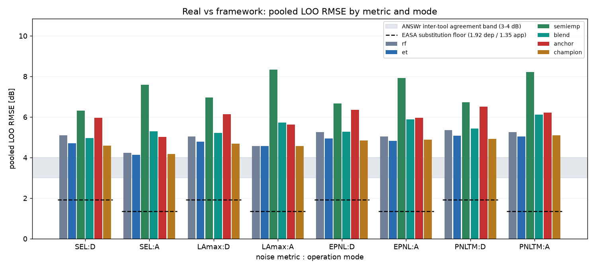
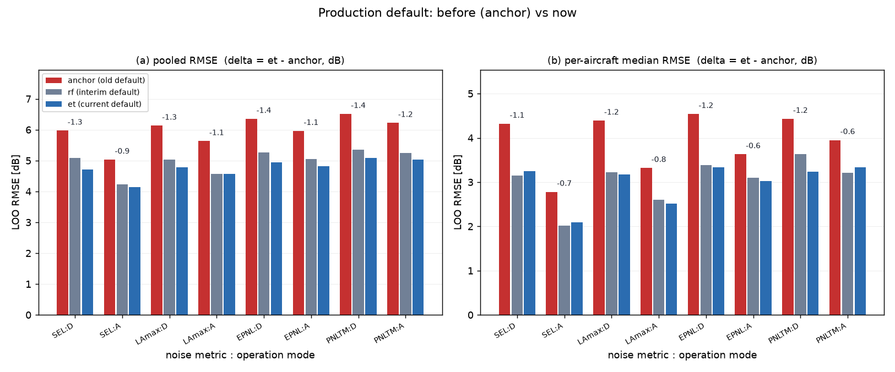
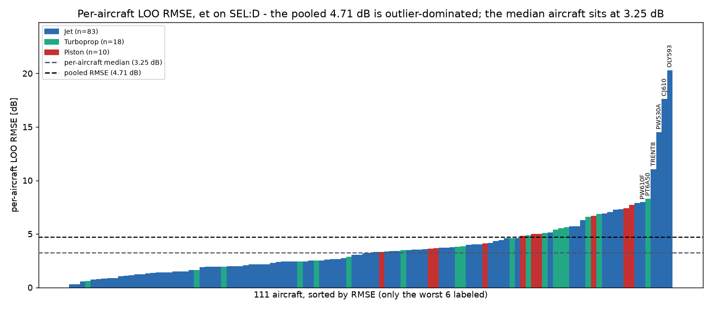
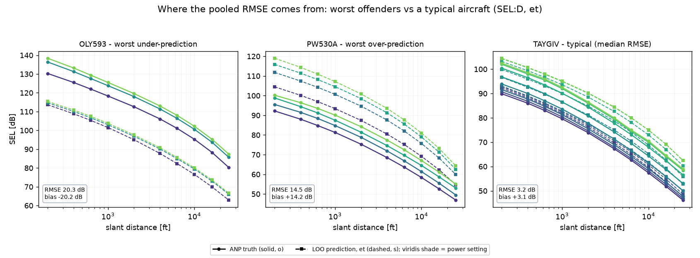
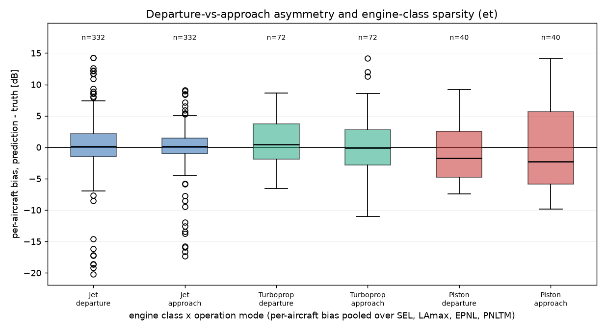
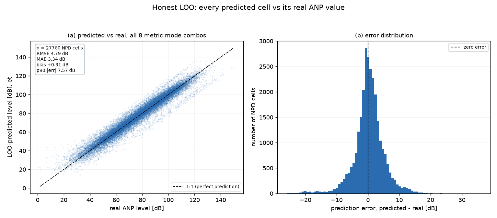

# PNMF - Gap-Analysis Report

> Historical pre-v6.3 analysis. Champion and experimental-model commands below
> are retired from the supported workflow. See
> `MIGRATION_PROGRESS_REPORT.md`.

**Parametric Noise Modeling Framework** - TU Darmstadt / FSR Advanced Design Project (Prof. Klingauf, supervised by L. Kempf)

*Report date: 2026-07-15, rendered by `pnmf_cli.py report` from the persisted LOO artifacts in `outputs/` (no model was fitted to produce this document). Production default model at render time: `et` (`pnmf.api.DEFAULT_MODEL`). Figures are frozen copies in `docs/figures/` of the corresponding `outputs/` artifacts.*

---

## 1. Executive summary

The **gap** analyzed here is the cell-by-cell difference between the NPD table the framework predicts for an aircraft *from its parameters alone* and the real, certification-derived ANP table for that same aircraft. Every number is **honest leave-one-aircraft-out (LOO)**: the model is retrained with the aircraft removed, then asked to predict it - the framework never sees the curves it is judged on.

Headline: old production default (`anchor`) vs current default (`et`), all values dB, lower is better; delta = `et` - `anchor`.

| metric:mode | anchor pooled | et pooled | delta pooled | anchor median | et median | delta median |
|---|---|---|---|---|---|---|
| SEL:D | 5.97 | 4.71 | -1.26 | 4.32 | 3.25 | -1.07 |
| SEL:A | 5.03 | 4.14 | -0.89 | 2.78 | 2.09 | -0.69 |
| LAmax:D | 6.13 | 4.78 | -1.35 | 4.39 | 3.17 | -1.22 |
| LAmax:A | 5.63 | 4.56 | -1.07 | 3.32 | 2.51 | -0.81 |
| EPNL:D | 6.35 | 4.95 | -1.40 | 4.54 | 3.34 | -1.20 |
| EPNL:A | 5.96 | 4.82 | -1.14 | 3.63 | 3.02 | -0.61 |
| PNLTM:D | 6.51 | 5.08 | -1.43 | 4.43 | 3.24 | -1.19 |
| PNLTM:A | 6.22 | 5.04 | -1.18 | 3.95 | 3.33 | -0.62 |

Context for reading these numbers:

- **EASA manual-substitution floor**: even EASA's hand-curated real-aircraft proxy substitutions carry 1.92 dB RMSE on departure and 1.35 dB on approach against certification levels (n = 19,565 certificated aircraft).
- **ANSWr inter-tool agreement band**: established noise tools disagree with each other by 3-4 dB on the same scenarios.
- **Independent physics route**: the from-scratch physics model (frozen A320-211 calibration) reaches 2.82 dB median out-of-sample RMSE (SEL/LAmax only) with no fleet training at all.



## 2. Method

- **Population**: the 111 ANP aircraft with full NPD curve sets (83 Jet / 18 Turboprop / 10 Piston).
- **Targets**: 4 metrics (SEL, EPNL, LAmax, PNLTM) x 2 operation modes (D departure / A approach) x 10 standard distances (200-25,000 ft) at each published power setting.
- **LOO protocol**: for each aircraft, retrain the model on the other aircraft, then predict the held-out aircraft from its parametric definition only (thrust, weights, engine count/type, noise chapter).
- **Two error views, both reported**: *pooled* RMSE (all cells of all aircraft in one pool - sensitive to outliers) and the *per-aircraft median* RMSE (what the typical aircraft experiences). A single atypical airframe can move the pooled number by whole dB while the median barely reacts - reporting only one of them would be misleading.

The six candidate models in the bake-off:

- `rf` - SurrogateNPDModel("rf"): RandomForest on unit-aware power/weight/configuration features, isotonic distance monotonicity, cross-tree uncertainty.
- `et` - SurrogateNPDModel("et"): ExtraTrees with the best registry-independent configuration found by the evolutionary search, embedded statically.
- `semiemp` - SemiEmpiricalNPDModel: interpretable anchor+decay+slope regression.
- `blend` - BlendNPDModel: 0.5 x rf + 0.5 x semiemp.
- `anchor` - AnchorDeltaNPDModel: nearest-donor real curve + RF residual correction (the pre-2026-07-14 production default).
- `champion` - EvolvedSurrogateModel: best configuration in the `model_trials` registry of `anp_data.sqlite`.

**Selection rule**: lowest mean per-aircraft median RMSE across the 8 metric:mode combos; ties within 0.05 dB are broken in favor of registry-independent static models.

## 3. Bake-off results

Per-aircraft **median** RMSE [dB] per combo (selection basis):

| metric:mode | rf | et | semiemp | blend | anchor | champion |
|---|---|---|---|---|---|---|
| SEL:D | 3.15 | 3.25 | 3.77 | 3.36 | 4.32 | 3.43 |
| SEL:A | 2.02 | 2.09 | 3.23 | 2.49 | 2.78 | 2.08 |
| LAmax:D | 3.22 | 3.17 | 3.96 | 3.34 | 4.39 | 3.53 |
| LAmax:A | 2.60 | 2.51 | 3.71 | 2.84 | 3.32 | 2.51 |
| EPNL:D | 3.38 | 3.34 | 3.91 | 3.81 | 4.54 | 3.52 |
| EPNL:A | 3.10 | 3.02 | 4.36 | 3.30 | 3.63 | 3.04 |
| PNLTM:D | 3.63 | 3.24 | 4.48 | 3.87 | 4.43 | 3.29 |
| PNLTM:A | 3.21 | 3.33 | 4.17 | 3.23 | 3.95 | 3.24 |

**Pooled** RMSE [dB] per combo:

| metric:mode | rf | et | semiemp | blend | anchor | champion |
|---|---|---|---|---|---|---|
| SEL:D | 5.09 | 4.71 | 6.31 | 4.97 | 5.97 | 4.59 |
| SEL:A | 4.23 | 4.14 | 7.60 | 5.29 | 5.03 | 4.18 |
| LAmax:D | 5.04 | 4.78 | 6.96 | 5.22 | 6.13 | 4.68 |
| LAmax:A | 4.57 | 4.56 | 8.34 | 5.73 | 5.63 | 4.56 |
| EPNL:D | 5.26 | 4.95 | 6.67 | 5.27 | 6.35 | 4.85 |
| EPNL:A | 5.05 | 4.82 | 7.92 | 5.88 | 5.96 | 4.88 |
| PNLTM:D | 5.36 | 5.08 | 6.73 | 5.43 | 6.51 | 4.92 |
| PNLTM:A | 5.25 | 5.04 | 8.21 | 6.12 | 6.22 | 5.10 |

Ranking (mean per-aircraft median RMSE across the 8 combos):

| rank | model | mean median RMSE [dB] |
|---|---|---|
| 1 | et | 2.99 |
| 2 | rf | 3.04 |
| 3 | champion | 3.08 |
| 4 | blend | 3.28 |
| 5 | anchor | 3.92 |
| 6 | semiemp | 3.95 |

**Decision record**: the shipped production default is `et` (`pnmf.api.DEFAULT_MODEL`).

`champion` is **never** the shipped default even when it is numerically best: it needs a populated `model_trials` registry in `anp_data.sqlite`, so a fresh install (empty registry) would crash. The registry champion is ExtraTrees (n_estimators=500, min_samples_leaf=1, max_depth=24, max_features='sqrt') plus a power-loading derived feature, at grouped-CV RMSE 4.678 dB over 43 trials; the static `et` learner embeds the best derived-feature-free configuration (max_features=0.5, CV 4.686 dB) and needs no registry.

Cross-check - the official `validate` record (`outputs/validation_summary.csv`, rf surrogate vs the semi-empirical reference):

| metric | mode | n | surrogate_RMSE | surrogate_MAE | surrogate_bias | surrogate_p90 | semiemp_RMSE | semiemp_MAE |
|---|---|---|---|---|---|---|---|---|
| EPNL | A | 111 | 5.05 | 3.46 | 0.15 | 8.17 | 7.92 | 5.34 |
| EPNL | D | 111 | 5.26 | 3.7 | 0.26 | 7.64 | 6.67 | 4.81 |
| LAmax | A | 111 | 4.57 | 3.15 | 0.19 | 7.4 | 8.34 | 5.22 |
| LAmax | D | 111 | 5.04 | 3.6 | 0.25 | 7.27 | 6.96 | 4.87 |
| PNLTM | A | 111 | 5.25 | 3.61 | 0.13 | 8.58 | 8.21 | 5.54 |
| PNLTM | D | 111 | 5.36 | 3.86 | 0.19 | 8.27 | 6.73 | 4.82 |
| SEL | A | 111 | 4.23 | 2.82 | 0.11 | 6.47 | 7.6 | 4.61 |
| SEL | D | 111 | 5.09 | 3.52 | 0.32 | 7.02 | 6.31 | 4.48 |

## 4. What changed and what it bought

- **Two self-improvement sessions** on 2026-07-14 (seeds 42 and 43, 15 trials each): champion grouped-CV RMSE improved 4.686 -> 4.678 dB (rf baseline: 5.208 dB).
- **New static `et` learner** in `SurrogateNPDModel`/`api`, embedding the best registry-independent configuration from that search.
- **Default trajectory**: `anchor` -> `rf` (2026-07-14 bake-off) -> `et` (this bake-off, read from `pnmf.api.DEFAULT_MODEL` at render time).
- **Hygiene fix**: `validation_summary.csv` append-duplication fixed (rerunning a combo now *replaces* its row).
- **QA record** (predict pipeline gate): anchor era (2026-07-12) 4 ok / 4 caution; rf: 8 ok / 0 caution / 0 rejected (physics crosscheck SEL 2.63 / LAmax 2.20 dB); et: 8 ok / 0 caution / 0 rejected (SEL 3.27 / LAmax 2.21 dB). QA thresholds unchanged throughout (std 3.0 dB, crosscheck 5.0 dB, bounds 20-160 dB).



## 5. Where the remaining gap lives

The pooled RMSE is not spread evenly over the fleet - it is concentrated in a handful of aircraft at the edge of (or outside) the training envelope:



Top 6 worst aircraft for `et` on SEL:D:

| npd_id | engine | RMSE [dB] | bias [dB] | cause |
|---|---|---|---|---|
| OLY593 | Jet | 20.30 | -20.20 | Olympus 593 (Concorde-class afterburning turbojet) - far outside the fleet envelope; heavily under-predicted |
| CJ610 | Jet | 17.61 | -17.18 | small early-generation turbojet business jet - under-predicted |
| PW530A | Jet | 14.51 | +14.24 | sparse-class / envelope-edge case (Jet; over-predicted) |
| TRENT8 | Jet | 11.06 | +10.87 | 777-class heavy twin at the very top of the thrust range - over-predicted |
| PT6A50 | Turboprop | 8.29 | +8.19 | sparse-class / envelope-edge case (Turboprop; over-predicted) |
| PW610F | Jet | 7.97 | +7.94 | sparse-class / envelope-edge case (Jet; over-predicted) |







## 6. Why the gaps exist

### 6.1 Fleet-envelope extrapolation
Tree ensembles cannot extrapolate beyond the convex hull of their training features; an atypical engine (afterburning turbojet, top-of-range heavy twin) reverts toward fleet-average behavior, producing the large signed errors in Figure 4.

### 6.2 Missing BPR/geometry features
`ParametricAircraft` has `bypass_ratio`/`fan_diameter`/wing fields, but the ANP database does not populate them, so the surrogate sees only thrust, weights, engine count/type and noise chapter. This is the documented #1 residual-gap cause and the top future-work item.

### 6.3 Departure worse than approach
Departure is engine/thrust-dominated - exactly where unobserved engine technology matters most - while approach is airframe/idle-dominated and fleet-uniform. For `et`, the mean per-aircraft median RMSE is 3.25 dB on departure vs 2.74 dB on approach (see also Figure 5).

### 6.4 Mixed power axes
4 aircraft publish RPM power settings instead of thrust; these go through a crude throttle imputation that adds error for exactly those aircraft.

### 6.5 Class sparsity
10 pistons and 18 turboprops vs 83 jets: the non-jet classes are too sparse for the model to learn class-specific behavior, visible as wider bias boxes in Figure 5.

### 6.6 Pooled vs median
The pooled RMSE is dominated by a minority of atypical aircraft (Figure 3); the median aircraft sits at 3.25 dB on SEL:D - inside the ANSWr 3-4 dB inter-tool band.

### 6.7 Irreducible floor
Even EASA's hand-curated real-aircraft substitutions carry 1.92 dB (departure) / 1.35 dB (approach) RMSE. A parametric-only model cannot be expected to beat proxies built from real measured curves.

## 7. Functionality preservation record

Unchanged throughout the improvement work: QA thresholds and reason strings; `predicted_npd` schema; `anp_*` truth-table isolation; distance monotonicity (isotonic enforcement); Doc-29 interpolation; the physics route and its frozen A320-211 calibration; the feature vector order; all CLI flags and model strings. Hygiene fix: `validation_summary.csv` replace semantics. Test suite: 29 passed + 1 expected skip throughout.

## 8. Limitations and future work

- Wire BPR/geometry features from an aircraft-synthesis tool (PrADO / CPACS / RCAIDE) into the populated feature set (#1 item, see 6.2).
- ANP v6.3 xlsx loader (current loader reads the v2.3 CSV schema only).
- Per-engine-class models once more non-jet data is available.
- EPNL/PNLT tone correction for the physics route (currently SEL/LAmax only).

## 9. Reproduction record

```
# self-improvement (2026-07-14), fixed seeds
.venv\Scripts\python.exe pnmf_cli.py improve --trials 15 --seed 42
.venv\Scripts\python.exe pnmf_cli.py improve --trials 15 --seed 43

# full 8-combo LOO bake-off (2026-07-14/15)
.venv\Scripts\python.exe pnmf_cli.py compare

# official validation record
.venv\Scripts\python.exe pnmf_cli.py validate SEL:D SEL:A EPNL:D EPNL:A LAmax:D LAmax:A PNLTM:D PNLTM:A

# QA-gated prediction dry-run (no datastore writes)
.venv\Scripts\python.exe pnmf_cli.py predict --dry-run

# this report (reads persisted artifacts only)
.venv\Scripts\python.exe pnmf_cli.py report
```

Notes: tree-based results carry +-0.01-0.05 dB seed jitter between runs. Three bake-off combos were reconstructed losslessly from the persisted per-cell CSVs after a session crash; the reconstructed values were verified against the run log to +-0.01 dB.
