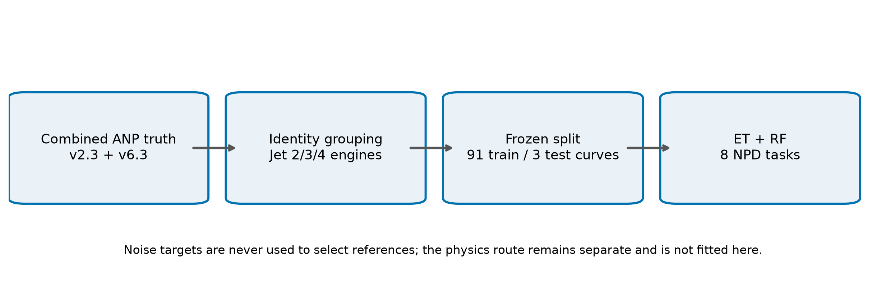
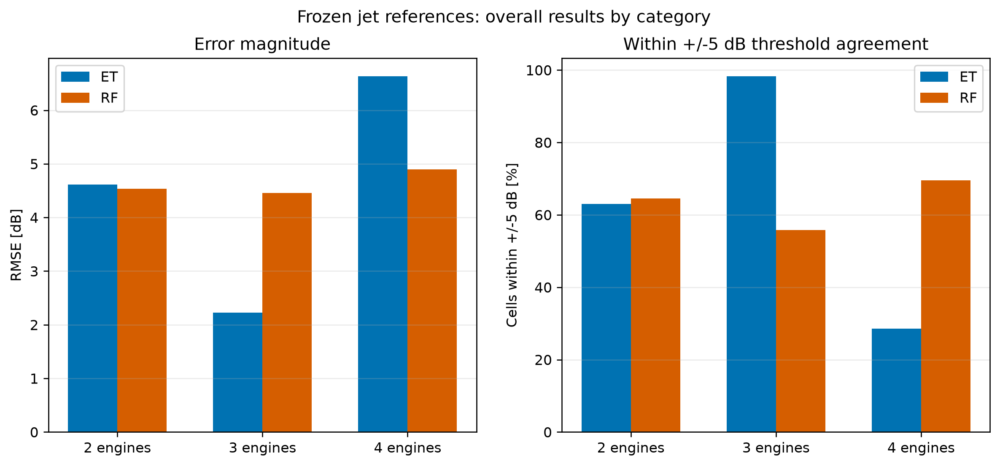
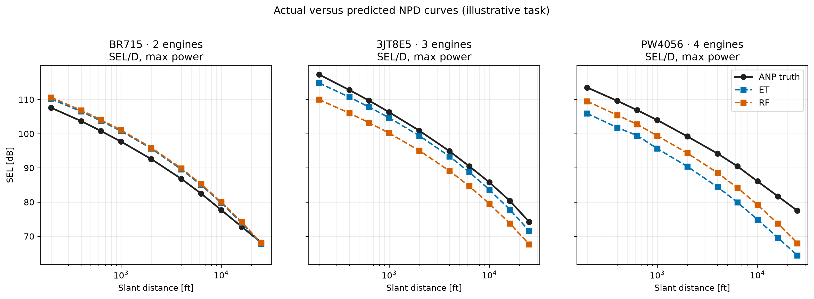
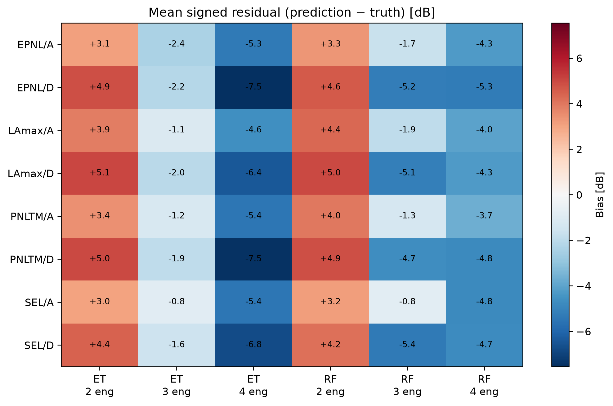

# Frozen Jet-Reference Validation Report

> Generated 2026-07-24T11:20:57.569548+00:00 from measured ANP truth. This is conceptual-screening evidence, not certification evidence.

## Plain-language result

Three ordinary jet references—one twin, one three-engine aircraft, and one four-engine aircraft—were frozen before model errors were calculated. Every aircraft identity connected to a reference curve was removed from training. Extra Trees (ET) and Random Forest (RF) then predicted the published NPD levels from aircraft descriptors and the requested power grid.

| model | aggregation | engine_count_category | rmse_dB | mae_dB | bias_dB | p90_abs_error_dB | pct_within_3_dB | pct_within_5_dB | n_cells |
| --- | --- | --- | --- | --- | --- | --- | --- | --- | --- |
| et | cell_pooled | all | 5.125 | 4.499 | -1.193 | 7.366 | 30.577 | 57.885 | 1040 |
| et | curve_category_balanced | all | 4.840 | 4.147 | -1.265 | 6.430 | 37.944 | 63.278 | 1040 |
| rf | cell_pooled | all | 4.659 | 4.304 | -0.992 | 6.427 | 23.173 | 64.423 | 1040 |
| rf | curve_category_balanced | all | 4.633 | 4.252 | -1.375 | 6.575 | 25.028 | 63.278 | 1040 |

Only three independent curves are tested. The 1,040 cells are repeated power/distance observations within those curves and are correlated; they are not 1,040 independent aircraft tests.

## Database and frozen selection

The canonical datastore combines the EASA ANP legacy v2.3 source with the v6.3 supplement. Among curves with all eight tasks, the jet subset contains 94 curves in 93 connected aircraft-identity groups. There are no one-engine jets; the categories are 2, 3 and 4 engines.

Reference selection never uses a noise target or prediction error. For each engine-count category, the population median and IQR are computed over all complete-task jet curves for `[log10(MTOW_lb), log10(total_static_thrust_lb), noise_chapter]`. A selectable candidate must be a one-curve, one-ACFT_ID identity group. Its score is

`distance = sqrt(sum_j (((x_j - median_j) / IQR_j)^2))`.

A zero-IQR feature contributes zero; lowest distance wins and NPD_ID lexical order is the exact tie-break. The implementation derives the following frozen mapping and fails if future datastore drift changes it:

- 2 engines: NPD `BR715`, ACFT_ID `717200`, robust distance `0.036467`.
- 3 engines: NPD `3JT8E5`, ACFT_ID `727EM2`, robust distance `0.023327`.
- 4 engines: NPD `PW4056`, ACFT_ID `747400`, robust distance `0.352528`.

## Exact separation and learning layout

Training uses 91 other jet curves; testing uses 3 frozen curves. Each approach task has 270 training and 10 held-out power rows; each departure task has 370 training and 16 held-out rows. Across all tasks the test has 104 power rows × 10 distances = 1040 truth cells.

Each model input is `[jet/turboprop/piston one-hot, engine count, log10(MTOW), log10(MLW), MLW/MTOW, log10(static thrust per engine), log10(total static thrust), noise chapter, log10(converted row power in lbf), throttle]`. The target is the ten-distance NPD level vector. The held-out power grid is part of the requested prediction; held-out noise levels are used only for scoring.

ET builds 500 highly randomized trees (`max_depth=24`, `max_features=0.5`, leaf size 1). RF builds 200 bootstrap trees (leaf size 2). Both use the frozen production settings and the normal non-increasing distance projection.

The separate `PhysicsNPDModel` is not trained or evaluated here. It remains an independent component-source cross-check for SEL and LAmax only; it does not supply features or targets to ET/RF.

## Measured results by category

| model | aggregation | engine_count_category | rmse_dB | mae_dB | bias_dB | p90_abs_error_dB | pct_within_3_dB | pct_within_5_dB | n_cells |
| --- | --- | --- | --- | --- | --- | --- | --- | --- | --- |
| et | cell_pooled | 2 | 4.611 | 4.269 | 4.248 | 6.610 | 28.000 | 63.000 | 400 |
| et | cell_pooled | 3 | 2.229 | 1.863 | -1.733 | 3.228 | 85.833 | 98.333 | 240 |
| et | cell_pooled | 4 | 6.636 | 6.310 | -6.310 | 9.452 | 0.000 | 28.500 | 400 |
| rf | cell_pooled | 2 | 4.534 | 4.294 | 4.288 | 6.255 | 20.000 | 64.500 | 400 |
| rf | cell_pooled | 3 | 4.459 | 3.914 | -3.867 | 6.334 | 37.083 | 55.833 | 240 |
| rf | cell_pooled | 4 | 4.893 | 4.547 | -4.547 | 7.136 | 18.000 | 69.500 | 400 |

RMSE emphasizes large misses; MAE is the typical absolute cell error; signed bias is positive when the model overpredicts; p90 is the 90th percentile absolute error. “Within ±3/±5 dB” is the percentage of correlated cells inside those bands, not a probability of aircraft-level success.

## Limitations and conclusion

- Three independent curves are too few for a population-wide accuracy or certification claim.
- Selection is representative only in three available descriptor dimensions; engine technology, geometry and family labels are not part of the rule.
- Power rows and distance cells within one curve are strongly correlated. Category-balanced results therefore matter alongside cell-pooled results.
- These references are interpolation-oriented conventional jets, not evidence for unconventional configurations or unseen families.

This experiment is a transparent, pre-frozen sanity check: it shows how the production ET/RF models behave on three typical jet curves with strict identity separation. It supplements, but does not replace, the broader grouped and temporal validation report.

## Reproducibility

- Seed `20260724`; runtime `9.003` s.
- Datastore SHA-256 `9b3ea2f58347ebb348128c49b3238e6a0b28852858fa7e87c89fad51d5e9fe8e`.
- Source-manifest SHA-256 `316d3362f1b064a54f6be1f026a11c3fe297a0172e4ad95fc44ba4e7e8e0683f`.
- Git `a1d488487e91041d5d1b60d17f627e84d5f56618`, dirty `True`.

All candidate scores, split roles, predictions, per-fit records, detailed task/category summaries and environment metadata are in `outputs/model_validation/jet_reference`.
